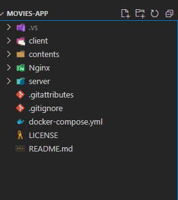

# Movies-App


# Required tools for running application
    1. Docker Desktop with linux container support
 # Steps to run the application using docker compose
 1. Move to directory MOVIES-APP
   
    

 2. Open command prompt/powershell/windows terminal here
 3. Run command ```docker compose up -d```
 4. Open browser and navigate to [home page](http://localhost:5000/home)